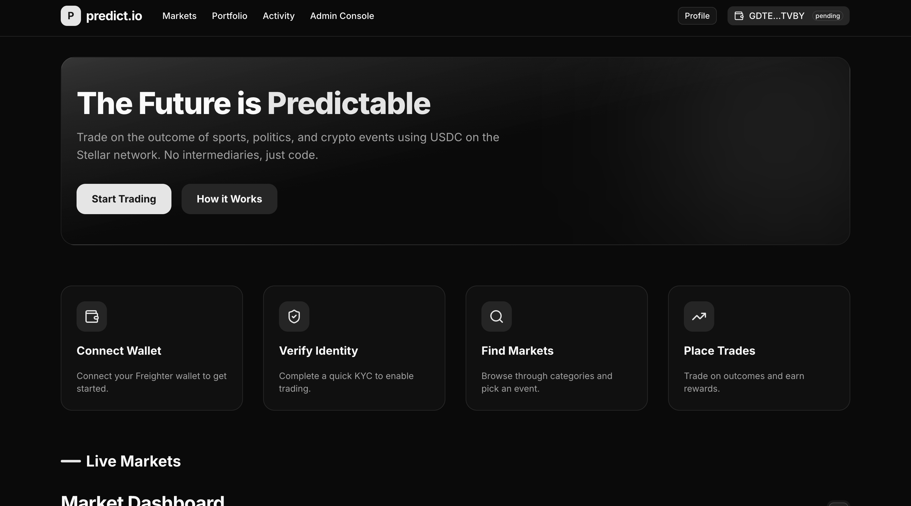
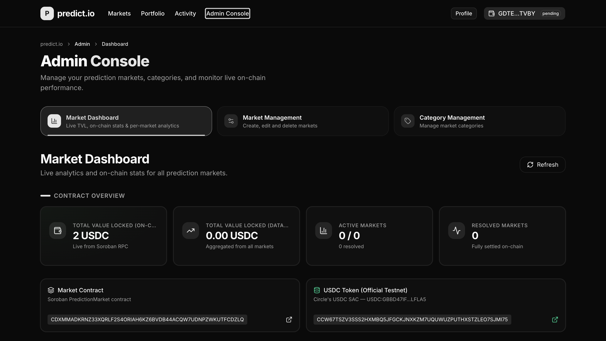
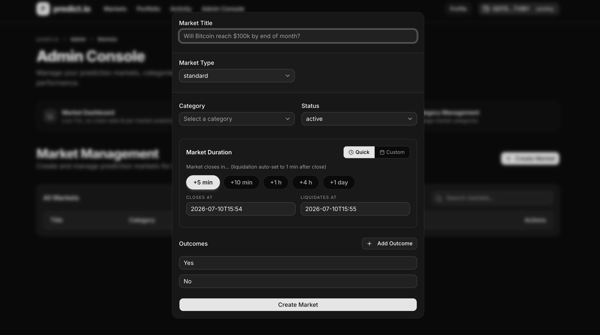

<div align="center">
  
</div>

<h1 align="center">Predict-IO 🔮</h1>

## 🎯 O problema que o projeto resolve
O mercado de previsões tradicional (Prediction Markets) muitas vezes sofre com falta de transparência, taxas altas e resoluções centralizadas sujeitas a manipulação. O **Predict-IO** resolve esse problema sendo uma plataforma verdadeiramente "trustless" e descentralizada, construída na rede **Stellar (Soroban)**. Ele permite a criação, negociação e liquidação de mercados de previsão de forma automatizada e segura, utilizando Oráculos On-chain (Reflector Network) para garantir que os resultados não sofram interferência centralizada, além de tratar micro-flutuações de preços com até 14 casas decimais de precisão.

## 🛠 Tecnologias utilizadas
- **Smart Contracts & Blockchain**: [Rust](https://www.rust-lang.org/), [Stellar Network (Soroban)](https://stellar.org/soroban) e [Reflector Oracle Network](https://reflector.network/).
- **Frontend & UI**: [React](https://react.dev/), [Tailwind CSS](https://tailwindcss.com/) e [shadcn/ui](https://ui.shadcn.com/). Integração com a carteira Stellar Freighter.
- **Backend & API**: [Node.js](https://nodejs.org/), [Fastify](https://fastify.dev/) e [Prisma ORM](https://www.prisma.io/).
- **Banco de Dados**: [PostgreSQL](https://www.postgresql.org/) (hospedado no [Supabase](https://supabase.com/)).
- **Linguagem**: [TypeScript](https://www.typescriptlang.org/) (Frontend e Backend) e [Rust](https://www.rust-lang.org/) (Contratos Inteligentes).

## 🚀 Como rodar ou acessar o projeto

### Pré-requisitos
- Node.js (v18 ou superior) & pnpm
- Rust & target `wasm32-unknown-unknown`
- Soroban CLI (`soroban`)
- Docker (para rodar o PostgreSQL localmente, se necessário)

### Instalação e Execução local

1. **Clone o repositório:**
   ```bash
   git clone https://github.com/jorgesoares2997/predict_io
   cd predict_io
   ```

2. **Setup dos Smart Contracts:**
   Compile e faça o deploy dos contratos para a Stellar Testnet.
   ```bash
   cd contracts
   rustup target add wasm32-unknown-unknown
   cargo build --target wasm32-unknown-unknown --release
   ```
   *Faça o deploy do `prediction_market` e `reflector_prediction_market` usando sua CLI do Soroban.*

3. **Setup do Backend:**
   ```bash
   cd backend
   pnpm install
   cp .env.example .env
   
   # Conecte ao seu projeto Supabase e aplique o schema
   npx supabase login
   npx supabase link --project-ref <YOUR_PROJECT_REF>
   npx prisma db push
   npx prisma db seed
   
   pnpm run dev
   ```

4. **Setup do Frontend:**
   ```bash
   cd frontend
   pnpm install
   cp .env.example .env.local
   
   # Inicie o servidor frontend
   pnpm run dev
   ```
   Acesse no navegador padrão: `http://localhost:3000`.

## ✨ Principais funcionalidades
- **Dual Market Types:** Mercados Padrão (resolvidos via API pelo backend) e Mercados Oracle (100% trustless, baseados no Reflector Network).
- **Resolução Trustless (Oracle Flow):** A liquidação dos mercados é feita internamente pelo contrato inteligente consultando o oráculo on-chain, sem interferência humana.
- **Tratamento de Micro-Flutuações:** Suporte a até 14 casas decimais para comparações granulares de preços de ativos (ex: BTC, ETH), eliminando empates falsos.
- **Reembolso em Empates (Refunds on Draws):** Se um mercado terminar em empate perfeito, o contrato destrava a pool para que os participantes retirem 100% de seus valores apostados.
- **Workers e Indexadores:** O backend possui rotinas Cron para monitorar a expiração de mercados e triggar chamadas de liquidação na blockchain automaticamente.

## 🧠 Decisões técnicas tomadas
- **Arquitetura Limpa (DDD):** O backend foi construído usando Domain-Driven Design (DDD), garantindo uma API escalável, altamente testável e resiliente, funcionando como um indexador do estado on-chain.
- **Descentralização Real com Reflector:** Em produção, o sistema consulta a rede oficial do Reflector (`Asset::Stellar(Address)`) para pegar o preço de consenso de ativos, garantindo dados 100% descentralizados.
- **Separação de Responsabilidades:** O frontend lida apenas com a exploração de mercados e transações (assinatura com Freighter), enquanto o backend atua como gateway rápido via cache, e a blockchain mantém toda a lógica e os fundos sob custódia de contratos imutáveis.

## 📸 Prints, vídeo, deploy ou exemplos de uso
- **Deploy:** [https://predi-ct-io.vercel.app/](https://predi-ct-io.vercel.app/)
- **Repositório:** [https://github.com/jorgesoares2997/predict_io](https://github.com/jorgesoares2997/predict_io)

> *Screenshots da aplicação*

### Home Page


### Página de Admin (Dashboard)


### Formulário de Criação de Mercado


## 🔮 Próximos passos de melhoria
- **Integração com Múltiplos Oráculos:** Expandir o suporte para outras redes de oráculos no ecossistema Stellar para abranger mercados não-cripto.
- **Painel Analítico de Usuário:** Desenvolver um dashboard avançado para os usuários rastrearem seu histórico de apostas, PnL (Lucros e Perdas) e estatísticas.
- **Mecanismo de Provisão de Liquidez:** Criar incentivos para provedores de liquidez iniciarem mercados com mais capital, reduzindo o slippage para apostadores.
- **Governança Descentralizada (DAO):** Implementar tokens de governança para que a comunidade decida as taxas da plataforma e novos tipos de mercados.
